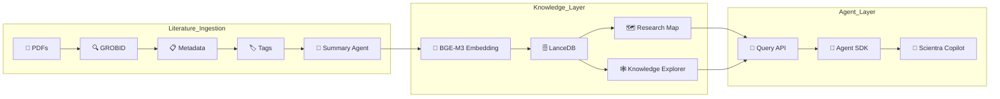

# Scientra Copilot

<p align="center">
  <h3 align="center">From Literature to Discovery</h3>
  <p align="center">
    AI-Powered Research Discovery Platform
  </p>
</p>

<p align="center">
  Transform scientific literature into structured knowledge, research maps, semantic search, and agent-ready workflows.
</p>

<p align="center">
  
  
  
</p>

---

# What is Scientra Copilot?

Scientra Copilot is an AI-powered research discovery platform that transforms scientific papers into a structured, searchable, and agent-consumable knowledge system.

Unlike traditional reference managers, Scientra focuses on:

* Knowledge Extraction
* Research Mapping
* Semantic Retrieval
* AI Agent Integration
* Research Discovery

It helps researchers move from **collecting papers** to **understanding research landscapes and discovering new ideas**.

---

# Architecture



---

# Core Features

## 📄 Literature Pipeline

* PDF ingestion
* GROBID parsing
* Metadata extraction
* Automatic tagging
* AI-assisted summaries
* Incremental processing

---

## 🧠 Knowledge Layer

* Knowledge Explorer
* Related Papers Engine
* Research Map
* Cluster Discovery
* Semantic Retrieval
* Multi-level Embeddings

---

## 🤖 Agent Layer

* Query API
* Agent SDK
* AI Copilot
* Context Pack Generation
* Agent-safe Retrieval
* Citation-grounded Responses

---

## 🔍 Search

Supports:

* Keyword Search
* Vector Search
* Hybrid Search
* Tag Filtering
* Metadata Filtering
* Evidence Retrieval

---

# Screenshots

## Dashboard

Track your literature collection, research activity, and knowledge statistics.


---

## Library

Search and explore your literature knowledge base.


---

## Knowledge Explorer

Interactive knowledge networks connecting concepts, methods, topics, and papers.


---

## Research Map

Automatically identify:

* Mature Topics
* Emerging Topics
* Research Gaps
* Knowledge Clusters


---

## AI Copilot

Chat with your literature and retrieve evidence-backed answers.


---

# Quick Start

## Requirements

* Python 3.11+
* Docker
* 8GB+ RAM
* GROBID
* BGE-M3

---

## Installation

```bash
git clone https://github.com/YOUR_USERNAME/scientra-copilot.git

cd scientra-copilot

pip install -r requirements.txt
```

---

## Start Everything

Windows:

```bash
start_scientra_os.bat
```

PowerShell:

```powershell
powershell -ExecutionPolicy Bypass -File start_scientra_os.ps1
```

---

## Import Papers

Place PDFs into:

```text
00_Inbox/
```

Run:

```bash
python workflow.py --all
```

---

# Project Structure

```text
Scientra_Copilot/

00_Inbox/
01_PDF/
02_Metadata/
03_Summary/
04_VectorDB/
05_Index/
06_API/
07_Workflows/
08_Agent_Interface/

Config/
Scripts/
docs/
Tests/

workflow.py
agent_sdk.py
```

---

# Use Cases

Scientra Copilot is designed for researchers in:

* Life Sciences
* Medicine
* Bioinformatics
* AI & Computer Science
* Materials Science
* Chemistry
* Environmental Science
* Social Sciences
* Any literature-driven research field

---

# Roadmap

## v0.2

* PDF Pipeline
* Knowledge Explorer
* Research Map
* Agent SDK

## v0.3

* Topic Engine
* AI Research Copilot
* Advanced Knowledge Discovery

## v0.4

* Citation Extraction
* Citation Network
* Research Evolution Analysis

## v1.0

* Word Integration
* Zotero Integration
* Cloud Workspace
* Multi-Agent Research Workflows

---

# 中文简介

## Scientra Copilot 是什么？

Scientra Copilot 是一个面向科研工作者的 AI 研究发现平台（AI-Powered Research Discovery Platform）。

它不仅仅是一个文献管理工具，也不仅仅是一个 PDF 阅读器。

Scientra Copilot 的目标是：

> 将文献转化为知识，将知识转化为发现。

核心流程：

```text
PDF
↓
Metadata
↓
Knowledge
↓
Research Map
↓
Agent
↓
Discovery
```

---

## 核心能力

### 📄 文献自动处理

* PDF 导入
* GROBID 解析
* Metadata 提取
* 标签生成
* AI 摘要

### 🧠 知识发现

* Knowledge Explorer
* Related Papers
* Research Map
* Research Gap Discovery
* Semantic Search

### 🤖 Agent 调用

* Query API
* Agent SDK
* AI Copilot
* Context Pack
* Agent-safe Retrieval

---

## 适用场景

适用于：

* 生物学
* 医学
* 材料科学
* AI与计算机科学
* 化学
* 环境科学
* 社会科学

以及任何依赖文献调研的科研领域。

---

# Contributing

Contributions are welcome.

Please see:

```text
CONTRIBUTING.md
```

for development setup and contribution guidelines.

---

# License

MIT License

---

<p align="center">
  <b>Scientra Copilot</b><br>
  From Literature to Discovery.
</p>
