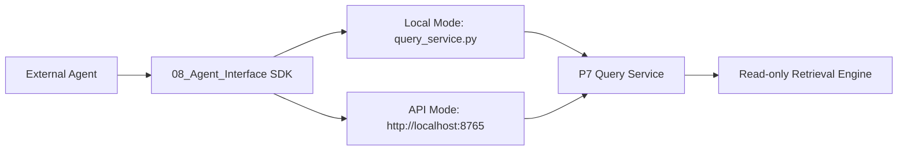

# Scientra Copilot Agent SDK Design

## Goal

P8 Agent SDK gives Claude Code Agent, Codex Agent, DeepSeek Agent, and other local Agents a low-friction way to consume Scientra Copilot while preserving the P7 boundary: all literature access goes through `literature_query()` or Query API endpoints.

## Architecture



The SDK is a consumer layer. It does not parse PDFs, read source text, query LanceDB directly, regenerate summaries, create embeddings, or call any LLM.

## Modes

### Local Mode

Recommended for Agents running on the same machine. Local Mode imports P7 `query_service.py` and calls it directly.

### API Mode

Recommended for cross-process, cross-tool, or future remote access. API Mode sends HTTP requests to:

```text
http://localhost:8765/query
```

## Public Functions

- `search()`: structured keyword/vector/hybrid retrieval.
- `retrieve()`: safe retrieval by `paper_id`, `chunk_id`, and `level`.
- `get_summary()`: summary plus citation anchors.
- `get_metadata()`: sanitized metadata.
- `get_tags()`: assigned and candidate tags.
- `get_evidence()`: evidence pack for a query.
- `ask_literature()`: compact context pack for an external Agent.

## Context Pack Contract

`ask_literature()` returns:

- `question`
- `filters`
- `selected_papers`
- `selected_summaries`
- `selected_evidence_chunks`
- `citation_anchors`
- `excluded_candidate_tags`
- `context_token_estimate`
- `retrieval_mode`
- `warnings`

Candidate tags are excluded from selected evidence by default. They may be reported in `excluded_candidate_tags` for transparency.

## Evidence Pack Contract

`get_evidence()` returns:

- `claim`
- `supporting_chunks`
- `paper_summaries`
- `citation_anchors`
- `confidence`
- `limitations`

The evidence pack is context only. The external Agent is responsible for final answer generation.

## Safety Boundaries

Forbidden in the SDK:

- reading PDF files
- reading full source text files
- reading TEI XML
- direct LanceDB access
- DeepSeek calls
- any LLM calls
- database mutation
- embedding writes
- document parsing

## P9 Readiness

P9 Workflow Engine can safely use this SDK for read-only evidence lookup once Local Mode and API Mode tests pass. Workflow write operations must remain outside the Agent SDK.

