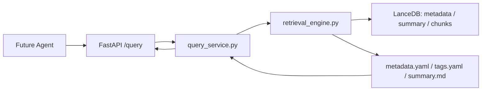

# Scientra Copilot Query API Design

## Purpose

P7 Query API is the read-only access layer for all future Agents. Agents must call `literature_query()` or the `/query` endpoint and must not directly access PDF files, raw text files, LanceDB tables, or embedding internals.

## Architecture



## Core Entry Point

```python
literature_query(
    query="Vip3Aa binding midgut",
    mode="hybrid",
    top_k=10,
    level="all",
    toxin="Vip3",
    include_candidate_tags=False,
)
```

Default behavior:

- `mode="hybrid"`
- `level="all"`
- `top_k=10`
- assigned tags are used for formal filtering
- candidate tags are excluded unless `include_candidate_tags=True`

## Retrieval Modes

- `keyword`: lexical scoring over indexed text, title, and assigned tags.
- `vector`: BGE-M3 query embedding against LanceDB tables.
- `hybrid`: weighted merge of vector and keyword scores.

## Levels

- `metadata`: paper-level metadata embedding table.
- `summary`: summary-level embedding table.
- `chunks`: raw_text-derived chunk embedding table.
- `all`: searches all three tables.

## Tag Filtering Policy

Assigned tags are authoritative. Candidate tags are returned for review but do not participate in default filtering.

When `include_candidate_tags=True`, candidate tags may extend recall with a score penalty. They never replace assigned tags and should be treated as weak evidence.

## API Endpoints

- `GET /health`
- `POST /query`
- `GET /paper/{paper_id}/summary`
- `GET /paper/{paper_id}/metadata`
- `GET /paper/{paper_id}/tags`
- `GET /stats`

## Result Contract

Each query result contains:

- `paper_id`
- `title`
- `year`
- `doi`
- `level`
- `record_id`
- `chunk_id`
- `score`
- `matched_tags`
- `assigned_tags`
- `candidate_tags`
- `text_preview`
- `source_path`
- `citation_anchor`
- `source_section`

`source_path` is a logical Scientra Copilot URI such as `scientra://summary/{paper_id}`. It does not expose local PDF, raw_text, TEI, or LanceDB file paths.

## Safety Boundaries

The P7 API is read-only.

Forbidden:

- direct raw_text return
- direct PDF path exposure
- direct LanceDB table exposure
- database mutation
- summary regeneration
- embedding regeneration
- DeepSeek calls
- PDF parsing

## P8 Readiness

P8 Agent SDK can depend on this API once P7 endpoint tests pass. The SDK should wrap `literature_query()` and the paper resource endpoints without introducing any database access.

