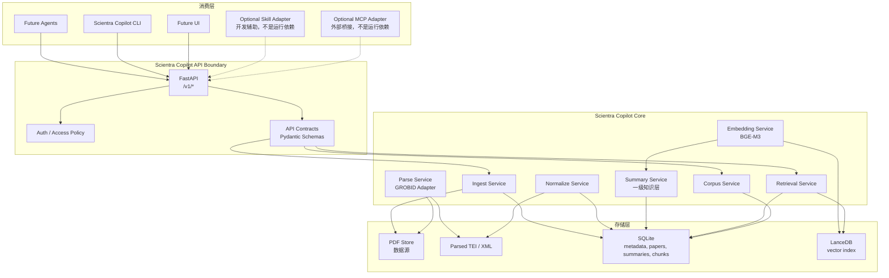
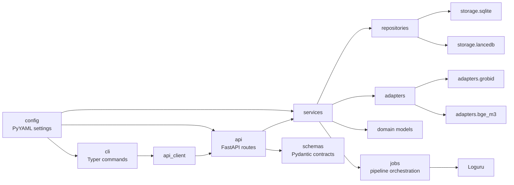
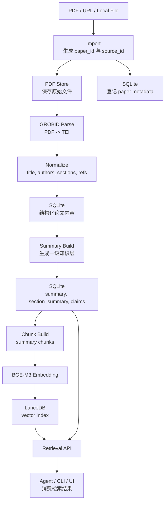
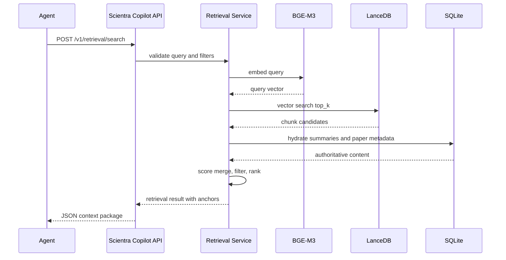
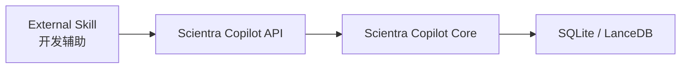
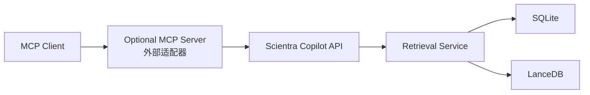

# Scientra Copilot Architecture

版本：v0.1  
状态：架构基线  
运行边界：独立运行，不依赖 Claude Code、Claude Skill、MCP

## 1. 设计原则

1. Scientra Copilot 必须独立运行。
2. Scientra Copilot 不允许依赖 Claude Code。
3. Scientra Copilot 不允许依赖 Claude Skill。
4. Scientra Copilot 不允许依赖 MCP。
5. Skill/MCP 只能作为开发辅助工具或外部适配器，不能进入 Scientra Copilot 运行时依赖链。
6. 所有 Agent 未来统一调用 Scientra Copilot API。
7. PDF 是数据源，不是知识库。
8. Summary 是一级知识层。
9. VectorDB 是检索层。
10. Agent 是消费层。

## 2. 技术栈

| 层级 | 技术 |
| --- | --- |
| 语言 | Python 3.11+ |
| API | FastAPI |
| CLI | Typer |
| 关系型存储 | SQLite |
| 向量检索 | LanceDB |
| 日志 | Loguru |
| 配置 | PyYAML |
| Embedding | BGE-M3 |
| PDF 结构解析 | GROBID |

## 3. 系统架构图



核心边界：

- PDF 只作为原始数据源保存，不能被 Agent 当作知识库直接消费。
- Summary 是面向知识消费的一级对象，必须拥有稳定 ID、版本、来源锚点和生成策略记录。
- LanceDB 只负责检索，不承载权威知识内容。
- SQLite 保存系统事实、元数据、Summary、Chunk、索引状态和任务状态。
- Agent、Skill、MCP 都不得直接访问 SQLite、LanceDB 或 PDF Store，必须通过 Scientra Copilot API。

## 4. 模块关系图



模块职责：

| 模块 | 职责 |
| --- | --- |
| `api` | FastAPI 路由、认证、请求响应模型绑定 |
| `cli` | Typer 命令，调用本地 API 或服务入口 |
| `core` | 领域模型、错误类型、ID 规则、状态机 |
| `services` | 导入、解析、摘要、嵌入、检索、语料管理 |
| `repositories` | SQLite 与 LanceDB 的读写封装 |
| `adapters` | GROBID、BGE-M3 等外部能力适配 |
| `jobs` | 长任务编排、重试、状态追踪 |
| `config` | YAML 配置加载、环境覆盖、路径解析 |
| `observability` | Loguru 日志、任务事件、错误记录 |

## 5. 数据流图



数据层定义：

| 层 | 定义 | 是否权威知识 | 被 Agent 直接消费 |
| --- | --- | --- | --- |
| PDF | 原始文件、导入来源 | 否 | 否 |
| Parsed Text / TEI | 结构化解析中间层 | 否 | 否 |
| Summary | 论文知识表达、章节摘要、关键声明 | 是 | 是，通过 API |
| VectorDB | Summary/Chunk 的向量索引 | 否 | 否 |
| Retrieval Result | API 组合后的检索响应 | 是，带引用和分数 | 是 |

## 6. 目录结构

目标目录：

```text
Scientra Copilot/
├── README.md
├── pyproject.toml
├── configs/
│   ├── default.yaml
│   └── logging.yaml
├── data/
│   ├── pdf/
│   ├── tei/
│   ├── sqlite/
│   └── lancedb/
├── docs/
│   └── Scientra Copilot_Architecture.md
├── scripts/
│   ├── init_db.py
│   └── run_grobid_check.py
├── src/
│   └── scientra/
│       ├── __init__.py
│       ├── api/
│       │   ├── app.py
│       │   ├── deps.py
│       │   └── routes/
│       │       ├── health.py
│       │       ├── papers.py
│       │       ├── summaries.py
│       │       ├── retrieval.py
│       │       └── jobs.py
│       ├── cli/
│       │   └── main.py
│       ├── config/
│       │   ├── loader.py
│       │   └── schema.py
│       ├── core/
│       │   ├── ids.py
│       │   ├── models.py
│       │   ├── states.py
│       │   └── errors.py
│       ├── services/
│       │   ├── ingest_service.py
│       │   ├── parse_service.py
│       │   ├── normalize_service.py
│       │   ├── summary_service.py
│       │   ├── embedding_service.py
│       │   ├── retrieval_service.py
│       │   └── corpus_service.py
│       ├── repositories/
│       │   ├── sqlite_repo.py
│       │   ├── lancedb_repo.py
│       │   └── unit_of_work.py
│       ├── adapters/
│       │   ├── grobid_client.py
│       │   └── bge_m3_embedder.py
│       ├── jobs/
│       │   ├── pipeline.py
│       │   └── worker.py
│       └── observability/
│           └── logging.py
└── tests/
    ├── unit/
    ├── integration/
    └── fixtures/
```

目录原则：

- `src/scientra` 是唯一运行时代码根。
- `docs` 只保存架构、协议和运维文档。
- `data/pdf` 保存原始 PDF，不作为知识库查询入口。
- `data/sqlite` 保存 SQLite 数据库文件。
- `data/lancedb` 保存 LanceDB 表和索引。
- `configs` 使用 PyYAML 加载，可被环境变量覆盖。

## 7. API 设计

API 前缀：`/v1`

### 7.1 Health

| Method | Path | 说明 |
| --- | --- | --- |
| `GET` | `/health` | 服务健康检查 |
| `GET` | `/v1/status` | 返回 SQLite、LanceDB、GROBID、Embedding 可用性 |

### 7.2 Papers

| Method | Path | 说明 |
| --- | --- | --- |
| `POST` | `/v1/papers/import` | 导入 PDF、本地路径或 URL，返回 `paper_id` 和 `job_id` |
| `GET` | `/v1/papers` | 分页列出论文 |
| `GET` | `/v1/papers/{paper_id}` | 获取论文元数据与处理状态 |
| `DELETE` | `/v1/papers/{paper_id}` | 删除论文记录、Summary 和索引，保留或删除 PDF 由策略决定 |

导入请求：

```json
{
  "source_type": "file_path",
  "source": "G:/papers/example.pdf",
  "tags": ["llm-agent", "planning"],
  "collection": "agent-literature",
  "auto_parse": true,
  "auto_summarize": true,
  "auto_index": true
}
```

导入响应：

```json
{
  "paper_id": "paper_01J...",
  "job_id": "job_01J...",
  "status": "queued"
}
```

### 7.3 Parsing

| Method | Path | 说明 |
| --- | --- | --- |
| `POST` | `/v1/papers/{paper_id}/parse` | 触发 GROBID 解析 |
| `GET` | `/v1/papers/{paper_id}/sections` | 返回规范化章节 |
| `GET` | `/v1/papers/{paper_id}/references` | 返回参考文献 |

### 7.4 Summaries

| Method | Path | 说明 |
| --- | --- | --- |
| `POST` | `/v1/papers/{paper_id}/summaries` | 生成或重建 Summary |
| `GET` | `/v1/papers/{paper_id}/summaries` | 获取论文 Summary 列表 |
| `GET` | `/v1/summaries/{summary_id}` | 获取单个 Summary |
| `POST` | `/v1/summaries/{summary_id}/index` | 对 Summary 建立或刷新向量索引 |

Summary 对象：

```json
{
  "summary_id": "sum_01J...",
  "paper_id": "paper_01J...",
  "summary_type": "paper_overview",
  "version": 1,
  "language": "zh-CN",
  "content": "string",
  "source_anchors": [
    {
      "section_id": "sec_01J...",
      "page_start": 3,
      "page_end": 4
    }
  ],
  "created_at": "2026-06-08T00:00:00Z"
}
```

### 7.5 Retrieval

| Method | Path | 说明 |
| --- | --- | --- |
| `POST` | `/v1/retrieval/search` | Summary 语义检索 |
| `POST` | `/v1/retrieval/answer-context` | 返回 Agent 可直接使用的上下文包 |
| `POST` | `/v1/retrieval/similar-papers` | 基于 Summary 查找相似论文 |

检索请求：

```json
{
  "query": "How do planning agents manage long-horizon tasks?",
  "collection": "agent-literature",
  "top_k": 8,
  "filters": {
    "tags": ["planning"],
    "year_gte": 2022
  },
  "include_chunks": true,
  "include_paper_metadata": true
}
```

检索响应：

```json
{
  "query_id": "qry_01J...",
  "results": [
    {
      "summary_id": "sum_01J...",
      "paper_id": "paper_01J...",
      "chunk_id": "chk_01J...",
      "score": 0.82,
      "title": "string",
      "content": "string",
      "source_anchors": [
        {
          "section_id": "sec_01J...",
          "page_start": 5,
          "page_end": 6
        }
      ]
    }
  ]
}
```

### 7.6 Jobs

| Method | Path | 说明 |
| --- | --- | --- |
| `GET` | `/v1/jobs/{job_id}` | 查询任务状态 |
| `POST` | `/v1/jobs/{job_id}/cancel` | 取消任务 |
| `GET` | `/v1/jobs` | 按状态列出任务 |

任务状态：

```text
queued -> running -> succeeded
queued -> running -> failed
queued -> canceled
```

## 8. 检索流程



检索策略：

1. Query 进入 API 后先做参数校验、过滤条件标准化和审计记录。
2. BGE-M3 生成 Query Embedding。
3. LanceDB 只返回候选 `chunk_id`、`summary_id`、向量分数和索引元数据。
4. Retrieval Service 必须回 SQLite 读取 Summary 正文、论文元数据和来源锚点。
5. 结果排序可以组合向量分数、时间、标签、collection、引用关系和 Summary 类型权重。
6. 返回给 Agent 的内容必须是 Summary 或 Summary Chunk，不直接返回 PDF 原文作为默认上下文。
7. 如 Agent 明确需要溯源，API 返回 `source_anchors`，但仍不暴露内部文件系统路径。

## 9. SQLite 数据模型

最低表集合：

| Table | 说明 |
| --- | --- |
| `papers` | 论文主表，保存 title、authors、year、doi、status |
| `sources` | PDF/URL/本地文件导入来源 |
| `sections` | GROBID 解析后的章节 |
| `references` | 参考文献 |
| `summaries` | 一级知识层主表 |
| `summary_chunks` | Summary 切块 |
| `embeddings` | Chunk 与 LanceDB 记录映射 |
| `collections` | 语料集合 |
| `paper_tags` | 标签 |
| `jobs` | 长任务状态 |
| `events` | 任务事件和审计日志 |

关键约束：

- `summaries.paper_id` 必须引用 `papers.paper_id`。
- `summary_chunks.summary_id` 必须引用 `summaries.summary_id`。
- `embeddings.chunk_id` 必须引用 `summary_chunks.chunk_id`。
- LanceDB 的每条向量记录必须能通过 `chunk_id` 回 SQLite 找到权威内容。
- 删除论文时必须同步处理 Summary、Chunk、Embedding 和 LanceDB 记录。

## 10. LanceDB 索引设计

表名建议：`summary_chunks`

字段：

| Field | Type | 说明 |
| --- | --- | --- |
| `vector` | vector | BGE-M3 embedding |
| `chunk_id` | string | Summary Chunk ID |
| `summary_id` | string | Summary ID |
| `paper_id` | string | Paper ID |
| `collection` | string | 语料集合 |
| `summary_type` | string | Summary 类型 |
| `language` | string | 语言 |
| `tags` | list[string] | 标签 |
| `year` | int | 年份 |
| `indexed_at` | timestamp | 索引时间 |

索引原则：

- LanceDB 只存检索必要元数据，不保存完整知识正文。
- Vector 版本必须记录 Embedding 模型名和参数。
- Summary 更新后，对应 Chunk 必须重新 Embedding 并刷新索引。

## 11. 未来 Agent 接入规范

Agent 是消费层，只能通过 Scientra Copilot API 接入。

必须遵守：

1. Agent 不得直接读取 PDF 文件。
2. Agent 不得直接读取 SQLite 数据库。
3. Agent 不得直接读取 LanceDB。
4. Agent 不得假设本地路径存在。
5. Agent 必须使用 `/v1/retrieval/*` 获取上下文。
6. Agent 需要论文详情时使用 `/v1/papers/*` 和 `/v1/summaries/*`。
7. Agent 在回答中引用知识时，应保留 `paper_id`、`summary_id`、`chunk_id` 和 `source_anchors`。

推荐调用流程：


Agent 上下文包格式：

```json
{
  "context_id": "ctx_01J...",
  "query": "string",
  "items": [
    {
      "paper_id": "paper_01J...",
      "summary_id": "sum_01J...",
      "chunk_id": "chk_01J...",
      "content": "string",
      "score": 0.82,
      "citation": {
        "title": "string",
        "authors": ["string"],
        "year": 2025
      },
      "source_anchors": []
    }
  ],
  "usage_policy": {
    "may_quote": true,
    "must_cite": true,
    "raw_pdf_available": false
  }
}
```

## 12. Skill 接入规范

Skill 只能作为开发辅助或外部调用方，不能成为 Scientra Copilot 的运行时组成部分。

允许：

- 帮助生成导入配置。
- 帮助批量调用 Scientra Copilot API。
- 帮助整理开发文档。
- 帮助调试 pipeline。
- 帮助创建测试数据。

禁止：

- Scientra Copilot import 或调用 Skill 代码。
- Scientra Copilot 运行依赖 Skill 文件、Skill 配置或 Skill 环境。
- Skill 直接写 SQLite 或 LanceDB。
- Skill 直接把 PDF 处理结果注入为知识层，绕过 Summary Service。

Skill 接入方式：



Skill 必须被视为外部客户端，其权限不高于普通 Agent。

## 13. MCP 接入规范

MCP 只能作为外部桥接协议，不得成为 Scientra Copilot 运行时依赖。

允许：

- 创建一个独立 MCP Server，将 MCP Tool 调用转换为 Scientra Copilot API 请求。
- 让外部 MCP Client 通过该桥接服务查询 Scientra Copilot。
- 用 MCP 在开发期测试 API。

禁止：

- Scientra Copilot 依赖 MCP Server 启动。
- Scientra Copilot 通过 MCP 访问自身数据。
- MCP Tool 直接访问 SQLite、LanceDB 或 PDF Store。
- MCP 返回绕过 Scientra Copilot API Contract 的内部数据结构。

MCP 桥接形态：



MCP Server 必须独立部署、独立配置、独立失败。MCP Server 不可用时，Scientra Copilot API 仍必须正常运行。

## 14. GROBID 接入规范

GROBID 是 PDF 结构解析适配器。

原则：

- GROBID 可以作为外部服务运行。
- Scientra Copilot 通过 `adapters.grobid_client` 调用 GROBID。
- GROBID 输出 TEI/XML，进入 Normalize Service。
- TEI/XML 是中间产物，不是 Agent 消费层。
- GROBID 失败不得破坏已导入 PDF 与已有 Summary。

配置示例：

```yaml
grobid:
  base_url: "http://localhost:8070"
  timeout_seconds: 120
  max_retries: 3
  save_tei: true
```

## 15. BGE-M3 接入规范

BGE-M3 是默认 Embedding 模型。

原则：

- Embedding 输入默认来自 Summary Chunk。
- 不默认对完整 PDF 原文直接建索引。
- Embedding 版本必须入库。
- 模型升级后必须支持按 collection 或 paper 批量重建索引。

配置示例：

```yaml
embedding:
  provider: "bge-m3"
  model_name: "BAAI/bge-m3"
  device: "auto"
  batch_size: 16
  normalize_embeddings: true
```

## 16. CLI 设计

CLI 使用 Typer，面向本地运维和开发。

命令建议：

```text
literature-os serve
literature-os status
literature-os import-pdf G:/papers/example.pdf --collection agent-literature
literature-os parse paper_01J...
literature-os summarize paper_01J...
literature-os index paper_01J...
literature-os search "planning agents" --top-k 8
literature-os job job_01J...
```

CLI 原则：

- CLI 默认调用 Scientra Copilot API。
- 管理命令可以在维护模式下调用内部服务，但不得改变 Agent 接入规范。
- CLI 输出必须包含稳定 ID，便于自动化流水线使用。

## 17. 配置设计

`configs/default.yaml`：

```yaml
app:
  name: "Scientra Copilot"
  environment: "local"
  api_prefix: "/v1"

paths:
  data_dir: "G:/AI_agent/Scientra Copilot/data"
  pdf_dir: "G:/AI_agent/Scientra Copilot/data/pdf"
  tei_dir: "G:/AI_agent/Scientra Copilot/data/tei"
  sqlite_path: "G:/AI_agent/Scientra Copilot/data/sqlite/scientra.db"
  lancedb_dir: "G:/AI_agent/Scientra Copilot/data/lancedb"

grobid:
  base_url: "http://localhost:8070"
  timeout_seconds: 120

embedding:
  provider: "bge-m3"
  model_name: "BAAI/bge-m3"
  batch_size: 16

retrieval:
  default_top_k: 8
  max_top_k: 50
```

## 18. 运行时依赖边界

Scientra Copilot 运行时允许依赖：

- Python 3.11+
- FastAPI
- Typer
- SQLite
- LanceDB
- Loguru
- PyYAML
- BGE-M3 运行环境
- GROBID 服务或本地 GROBID 部署

Scientra Copilot 运行时禁止依赖：

- Claude Code
- Claude Skill
- MCP
- 任意特定 Agent 框架
- 任意特定 IDE 或编辑器

## 19. 最小落地顺序

1. 初始化 `pyproject.toml`、配置加载、Loguru。
2. 建立 SQLite schema 和 LanceDB 连接。
3. 实现 FastAPI `health/status`。
4. 实现 PDF import 和 paper metadata。
5. 接入 GROBID parse。
6. 实现 Normalize Service。
7. 实现 Summary Service。
8. 实现 BGE-M3 Embedding 和 LanceDB indexing。
9. 实现 Retrieval API。
10. 实现 Agent context package。

## 20. 架构结论

Scientra Copilot 的核心不是 PDF 管理器，而是文献知识操作系统。

最终分层必须保持稳定：

```text
PDF = 数据源
Parsed Text = 中间层
Summary = 一级知识层
VectorDB = 检索层
API = 统一边界
Agent = 消费层
Skill/MCP = 外部辅助或适配器
```

只要这个边界不被破坏，未来可以替换 Embedding 模型、替换解析器、增加 UI、增加 Agent，或增加 MCP/Skill 外部桥接，而不会改变 Scientra Copilot 的独立运行能力。
