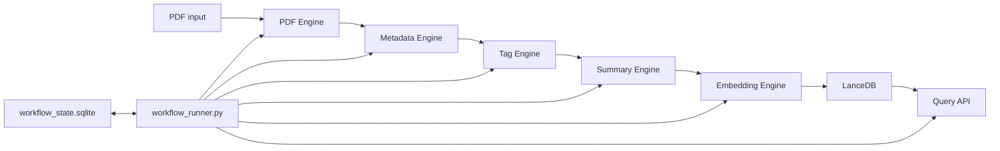

# Scientra Copilot Workflow Engine Design

## Goal

P9 Workflow Engine orchestrates the complete Scientra Copilot ingestion path:

```text
PDF -> GROBID/PyMuPDF Parse -> Metadata -> Tag -> Summary -> Embedding -> LanceDB -> Query API searchable
```

## Architecture



## State Model

State is stored in:

```text
05_Index/workflow_state.sqlite
```

Columns:

- `paper_id`
- `pdf_path`
- `parse_status`
- `metadata_status`
- `tag_status`
- `summary_status`
- `embedding_status`
- `lancedb_status`
- `error_message`
- `last_updated`
- `workflow_version`

## Resume Rule

When `--resume` is used, stages with a previous successful status and existing output artifacts are skipped. Failed or pending stages are retried from that point.

Example:

```text
parse completed
metadata completed
tag completed
summary failed
```

`--resume` will skip parse, metadata, and tag, then retry summary and downstream stages.

## Failure Policy

- A single paper failure does not stop the batch.
- Failure reasons are written to `workflow_state.sqlite`.
- Test and validation results are written to `05_Index/workflow_test_report.md`.
- Missing `DEEPSEEK_API_KEY` sets `summary_status=blocked_missing_api_key` when no cached or existing summary is available.
- No fake summary is generated.
- `--skip-summary` allows metadata/tag processing but prevents summary generation.
- `--skip-embedding` prevents embedding and LanceDB updates.

## GROBID Handling

Before PDF parsing, the workflow calls `Scripts/ensure_grobid.py`.

It checks:

```text
http://localhost:18070/api/isalive
```

If unavailable, it attempts:

```powershell
docker start scientra_grobid
```

If GROBID still does not recover before timeout, the PDF Engine is allowed to fall back to PyMuPDF.

## Agent Boundary

The workflow may update engine outputs and state. Agents still may only consume results through Agent SDK or Query API.

Forbidden for Agents:

- direct PDF access
- direct raw_text access
- direct TEI XML access
- direct LanceDB table access
- direct database mutation

